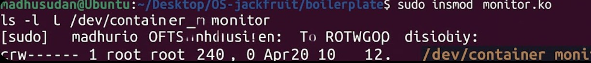
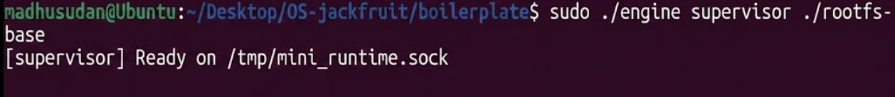
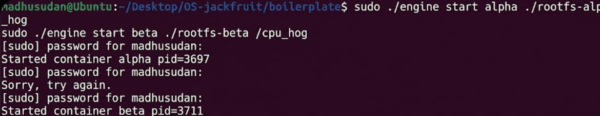
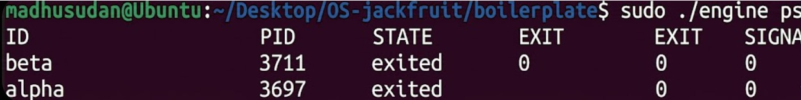
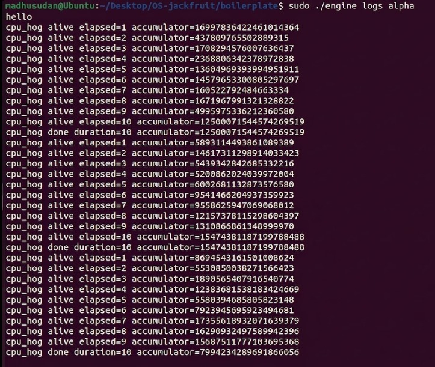
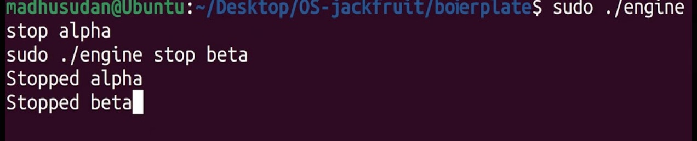
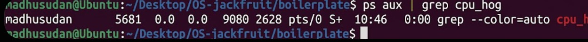
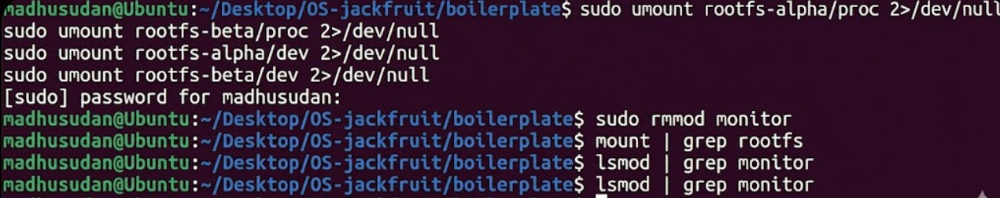

# Multi-Container Runtime

## Team Information

- Team Member 1: `Madhusudan P` - `PES1UG24AM375`
- Team Member 2: `Pranaav P` - `PES1UG24AM387`

## Project Overview

This project implements a lightweight Linux container runtime in C with a long-running supervisor and a kernel-space memory monitor. The runtime supports multiple containers, process and filesystem isolation, per-container logging, a CLI-based supervisor control plane, and kernel-assisted memory monitoring.

## Repository Contents

- [`engine.c`](./engine.c), [`monitor.c`](./monitor.c), [`monitor_ioctl.h`](./monitor_ioctl.h)
- [`boilerplate/`](./boilerplate) with the full implementation and inherited CI-safe build path
- [`Makefile`](./Makefile)
- workload programs: [`cpu_hog.c`](./cpu_hog.c), [`memory_hog.c`](./memory_hog.c), [`io_pulse.c`](./io_pulse.c)
- [`REPORT.md`](./REPORT.md)
- screenshot evidence in [`docs/screenshots/`](./docs/screenshots)

## Build, Load, and Run

```bash
make
sudo insmod monitor.ko
ls -l /dev/container_monitor
sudo ./engine supervisor ./rootfs-base
sudo ./engine start alpha ./rootfs-alpha /cpu_hog
sudo ./engine start beta ./rootfs-beta /cpu_hog
sudo ./engine ps
sudo ./engine logs alpha
sudo ./engine stop alpha
sudo ./engine stop beta
sudo rmmod monitor
```

CI-safe build:

```bash
make -C boilerplate ci
```

## CLI Reference

```bash
./engine supervisor <base-rootfs>
./engine start <id> <container-rootfs> <command> [--soft-mib N] [--hard-mib N] [--nice N]
./engine run   <id> <container-rootfs> <command> [--soft-mib N] [--hard-mib N] [--nice N]
./engine ps
./engine logs <id>
./engine stop <id>
```

## Demo Screenshots

### 1. Monitor device creation

The kernel module loads successfully and exposes `/dev/container_monitor`.



### 2. Supervisor startup

The long-running supervisor starts successfully and binds the runtime control socket.



### 3. Concurrent container launch

Two containers are started under the same supervisor process.



### 4. Metadata tracking

The `ps` command shows tracked container metadata from the supervisor.



### 5. Logging output

Per-container logs are persisted and can be retrieved using `engine logs`.



### 6. Controlled stop path

The supervisor accepts stop commands and cleanly terminates the tracked containers.



### 7. No lingering workload processes

After cleanup, the host no longer has active `cpu_hog` workload processes.



### 8. Module unload and filesystem cleanup

Mounted container filesystems are cleaned up and the monitor module is unloaded successfully.



## Design Decisions and Tradeoffs

### Namespace isolation

- Choice: `clone()` with PID, UTS, and mount namespaces plus `chroot()` for the container root filesystem.
- Tradeoff: `chroot()` is simpler than `pivot_root()`, but less strict if surrounding mount setup is weakened.
- Justification: it delivers the required isolation behavior with a compact and understandable implementation.

### Supervisor architecture

- Choice: one long-running parent supervisor owns lifecycle, state, logging, and control-plane coordination.
- Tradeoff: centralization simplifies correctness but makes the supervisor the coordination hub for all runtime actions.
- Justification: it is the cleanest design for correct reaping, metadata tracking, and signal handling.

### IPC and logging

- Choice: UNIX domain socket for CLI commands and anonymous pipes for container stdout/stderr.
- Tradeoff: using two IPC mechanisms adds implementation complexity, but each mechanism matches its workload well.
- Justification: control messages stay structured and request/response oriented, while logs remain stream based and efficient.

### Kernel monitor

- Choice: timer-driven monitoring with a mutex-protected kernel linked list of registered container PIDs.
- Tradeoff: polling is simpler than fully event-driven accounting, but checks happen at sampling intervals.
- Justification: it provides a robust soft-limit warning path and a hard-limit enforcement path with straightforward cleanup.

## Engineering Analysis

### 1. Isolation mechanisms

Isolation is achieved through Linux namespaces and filesystem remapping. `CLONE_NEWPID` isolates process numbering inside the container, `CLONE_NEWUTS` isolates the hostname, and `CLONE_NEWNS` gives each container its own mount view. `chroot()` changes the visible root directory, while a container-local `/proc` mount provides process visibility inside that isolated filesystem view. Even with these boundaries, the host kernel is still shared by all containers.

### 2. Supervisor and process lifecycle

The supervisor is responsible for creating containers, tracking their metadata, reaping child processes, and coordinating shutdown. This prevents zombie accumulation and keeps all lifecycle decisions in one place. Marking `stop_requested` before signaling a container also lets the runtime distinguish manual stop from an external or kernel-forced kill.

### 3. IPC, threads, and synchronization

The control plane and log plane are intentionally separate. CLI commands go through a UNIX domain socket because they need structured, short-lived request/response behavior. Logs use pipes because stdout and stderr are naturally byte streams. The bounded buffer uses a mutex plus condition variables so producers and consumers do not race on the ring-buffer indices and do not deadlock when the buffer is full or empty.

### 4. Memory management and enforcement

RSS represents the resident physical memory currently mapped into a process. It does not describe total virtual address space and it does not include swapped-out pages. Soft and hard limits are different policies: the soft limit acts as an early warning, while the hard limit is an enforcement threshold. Keeping this enforcement in kernel space is more reliable because the kernel has authoritative visibility into process memory and can act immediately.

### 5. Scheduling behavior

The runtime can be used as a platform for observing how Linux schedules competing workloads. CPU-bound tasks contend for processor time directly, so priority changes such as `nice` affect progress under contention. By contrast, I/O-oriented tasks often sleep and wake in short bursts, which helps the scheduler preserve responsiveness. This project exposes those differences through isolated workloads and structured logging.

## Report

See [`REPORT.md`](./REPORT.md) for the full written report and implementation summary.
